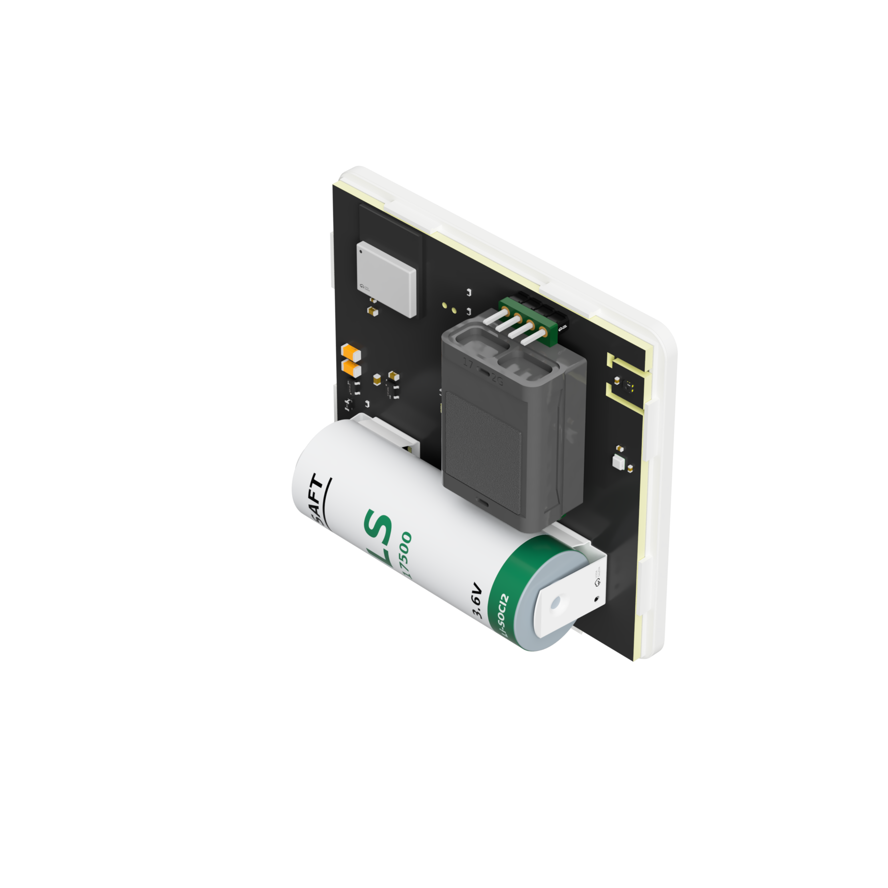

# SENSY-ONE AirBee

An ultra-low-power indoor air-quality sensor with selectable Zigbee or
Bluetooth Low Energy connectivity

AirBee measures CO₂, temperature, relative humidity and atmospheric pressure
every five minutes. It uses the pressure reading to compensate the CO₂ sensor
and keeps automatic calibration active while saving power between measurements.
Choose Zigbee or Bluetooth LE with the button

Key features:

- Selectable Zigbee or Bluetooth Low Energy connectivity
- Built-in Home Assistant support through BTHome in Bluetooth mode
- Five-minute CO₂, temperature, humidity and pressure measurements
- Pressure compensation for CO₂ measurements
- Automatic CO₂ baseline calibration
- Manual outdoor-air calibration when needed
- Signed Bluetooth firmware updates without programming hardware

## Getting Started

1. Insert a **SAFT LS17500 3.6 V battery**, following the + and − markings.
   AirBee starts automatically. Leave the button released while inserting the
   battery; holding it during startup starts CO₂ calibration.
2. Check the startup LED: **four red flashes mean Zigbee**, and **four blue
   flashes mean Bluetooth LE**. A new device starts in Zigbee mode.
3. To change modes, hold the button for about **five seconds**. Release it after
   the four flashes for the new mode. AirBee saves your choice and restarts.

**Connect with Zigbee**

Enable pairing on your Zigbee coordinator, then start AirBee in Zigbee mode.
If it is already powered on, remove the battery for at least three seconds and
reinsert it with the button released. AirBee searches for the network automatically.

**Connect with Bluetooth LE**

Make sure Home Assistant has a working Bluetooth adapter or Bluetooth proxy.
With AirBee in Bluetooth mode, open **Settings → Devices & services** and add
the discovered **BTHome** device. No Bluetooth pairing is needed.

Place AirBee where room air can reach the sensor and allow up to five minutes
for measurements to appear. The LED stays off during normal operation to save
power. A short button press does not trigger a measurement.

## Measurements and Accuracy

| Measurement | Sensor | Sensor range | Typical accuracy |
|---|---|---:|---:|
| CO₂ | [Senseair Sunrise](https://senseair.com/product/sunrise/) | 0–10,000 ppm | ±30 ppm + 3% of reading |
| Temperature | [Sensirion SHT45](https://sensirion.com/products/catalog/SHT45) | −40 to 125 °C | ±0.1 °C |
| Relative humidity | [Sensirion SHT45](https://sensirion.com/products/catalog/SHT45) | 0–100 %RH | ±1.0 %RH |
| Pressure | [Bosch BMP581](https://www.bosch-sensortec.com/products/environmental-sensors/pressure-sensors/bmp581/) | 300–1,250 hPa | ±30 Pa absolute at 300–1,100 hPa and −5 to 65 °C; ±6 Pa relative at 700–1,100 hPa and 15 to 55 °C |

Published resolution:

- CO₂: 1 ppm
- Temperature: 0.01 °C
- Relative humidity: 0.01 %RH
- Pressure: 1 hPa
 
Temperature is transmitted in degrees Celsius. A smart-home frontend can display
the same measurement in Fahrenheit.

## Power and Battery Life

AirBee is designed for the **SAFT LS17500**, a 3.6 V lithium-thionyl-chloride
battery with 3,600 mAh nominal capacity. The estimates below use the average
current measured over **five hours** in each wireless mode, with one measurement
cycle every five minutes.

| Wireless mode | Measured average | No self-discharge | 1% self-discharge per year |
|---|---:|---:|---:|
| Zigbee | **14.74 µA** | **27.88 years** | **≈24.58 years** |
| Bluetooth LE | **12.44 µA** | **33.04 years** | **≈28.53 years** |

The expected battery life is **at least 10 years** with one measurement cycle
every five minutes.

### Performance Test

- [Zigbee - 14.74 µA average over 5 hours](docs/images/airbee-zigbee-power-test-5h.png)
- [Bluetooth LE - 12.44 µA average over 5 hours](docs/images/airbee-ble-power-test-5h.png)

## Wireless Connectivity

### Zigbee

AirBee operates as a sleepy end device and publishes standard Zigbee Cluster
Library measurements:

| Cluster | ID |
|---|---:|
| Basic | `0x0000` |
| Identify | `0x0003` |
| Temperature Measurement | `0x0402` |
| Pressure Measurement | `0x0403` |
| Relative Humidity Measurement | `0x0405` |
| Carbon Dioxide Concentration Measurement | `0x040D` |

- Model: `AirBee`
- Manufacturer: `SENSY-ONE`

No manufacturer-specific measurement payload or custom Zigbee stack is used.

### Bluetooth Low Energy

Bluetooth mode works with Home Assistant through its built-in
[BTHome integration](https://www.home-assistant.io/integrations/bthome/).
No custom integration or pairing is needed.

1. Make sure Home Assistant has Bluetooth available through an adapter or
   Bluetooth proxy.
2. Switch AirBee to Bluetooth mode: hold the button for five seconds and release
   it after the four blue flashes.
3. In Home Assistant, open **Settings → Devices & services** and add the
   discovered BTHome device.

AirBee sends CO₂, temperature, humidity and pressure using
[BTHome v2](https://bthome.io/). Allow up to five minutes for the next broadcast.

## Mode Selection

Hold the button for five seconds to switch modes. AirBee confirms the new mode,
saves it and restarts automatically.

| Button action | Function | LED indication |
|---|---|---|
| Short press | No action | None |
| Hold for 5 seconds | Switch between Zigbee and Bluetooth LE | Four red flashes for Zigbee or four blue flashes for Bluetooth LE |
| Hold for 12 seconds | Start Bluetooth firmware update mode | Green flashes followed by continuous green blinking |
| Hold while inserting the battery | Start protected outdoor-air calibration immediately | Alternating red and blue while stabilizing, then solid green or solid red |

At normal startup, four blue flashes indicate Bluetooth LE and four red flashes
indicate Zigbee.

## CO₂ Calibration

AirBee uses automatic CO₂ baseline calibration with a fresh-air reference of
430 ppm. Calibration is retained between measurements, even while the CO₂ sensor
is powered down.

For installation or service, AirBee also provides a protected outdoor-air
calibration:

1. Place AirBee outdoors, away from people, open doors, combustion sources and
   traffic exhaust.
2. Remove the battery for at least three seconds.
3. Hold the button while inserting the battery. Calibration starts immediately;
   release the button when the LED begins alternating red and blue.
4. Leave AirBee undisturbed outdoors while the Sunrise takes repeated
   stabilization measurements and calibrates, which takes approximately ten
   minutes.
5. A solid green LED confirms success; a solid red LED indicates that
   calibration failed. The result remains visible until power is removed.
6. Remove the battery for at least three seconds, then insert it again without
   pressing the button. AirBee starts in its previously selected wireless mode.

Only use this procedure when AirBee is exposed to clean, stable outdoor air. Do
not calibrate indoors, near a person breathing onto the sensor, close to a road,
or near combustion equipment.

## Firmware Updates

AirBee can be updated wirelessly over Bluetooth Low Energy. Customers do not
need an ST-Link, programming adapter or development software.

1. Download [AirBee-update.gbl](firmware/v1.0.0/AirBee-update.gbl)
   using **Download raw file** on the file page.
2. Install Silicon Labs Simplicity Connect for
   [Android](https://play.google.com/store/apps/details?id=com.siliconlabs.bledemo)
   or [iOS](https://apps.apple.com/us/app/simplicity-connect/id1030932759).
3. Hold the AirBee button for 12 seconds. Continue holding after the first mode
   indication and release the button after the LED flashes green.
4. Open **Scan** in Simplicity Connect and scan for nearby devices.
5. Connect to **AirBee DFU**.
6. In the connected device view, tap **OTA Firmware** in the upper-right corner
   to open the update menu.
7. Set **Type** to **Partial** and **Mode** to **Reliability**.
8. Select `AirBee-update.gbl` and tap **Upload**.
9. Keep the mobile device close to AirBee until the transfer is complete.

The LED continues to blink green while AirBee is in firmware-update mode.
AirBee verifies the update and restarts automatically within a few seconds,
returning to the previously selected Zigbee or Bluetooth mode. Only firmware
digitally signed by SENSY-ONE is accepted. Never remove the battery while an
update is in progress.

## Hardware

| Function | Component |
|---|---|
| Wireless MCU | Silicon Labs MGM240PA22VNA3 |
| CO₂ | Senseair Sunrise |
| Temperature and humidity | Sensirion SHT45-AD1F-R2 |
| Atmospheric pressure | Bosch BMP581 |
| Battery | SAFT LS17500, 3.6 V, 3,600 mAh Li-SOCl₂ |

The [BTHome license statement](docs/license-statement-bthome.pdf) is included in this repository.

## Let's Connect

- Questions or need help? Join our [Discord community](https://discord.gg/TB78Wprn66).
- Found a bug or have an idea? Open an [issue on GitHub](https://github.com/sensy-one/AirBee/issues).
